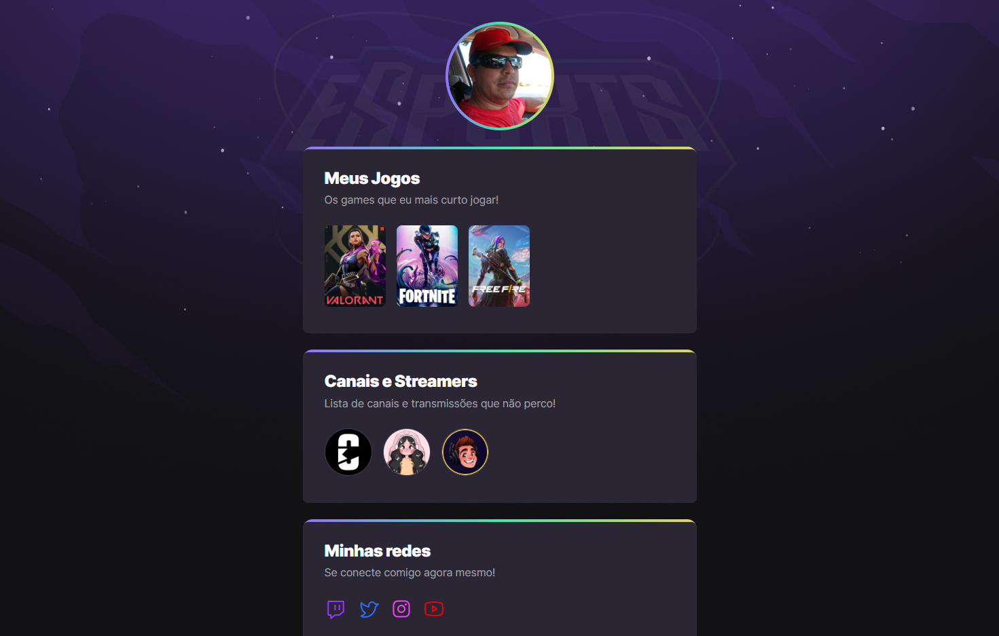

# NLW eSports

> Trilha Explorer

Projeto construído no evento Next Level Week da Rocketseat.

[CLIQUE AQUI PARA ACESSAR O PROJETO](https://sjtorres.github.io/Explorer/)

## Tecnologias
 

## Contato
sandrotorres.ti@gmail.com

## Tecnologias mais usadas:

<a href="https://github.com/sjtorres">

